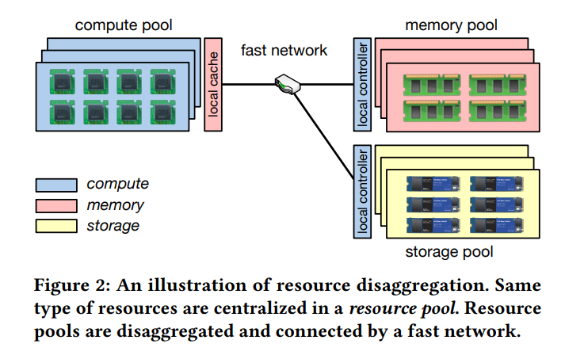
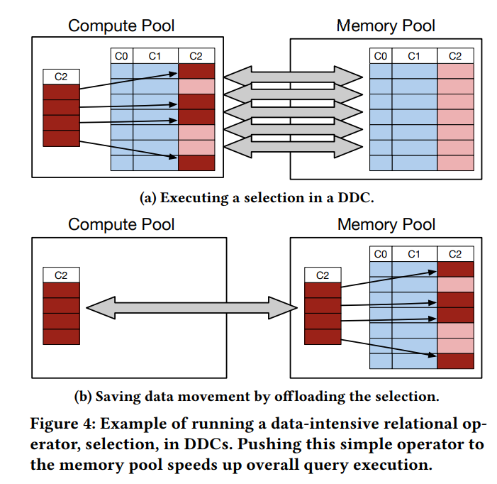

# [Optimizing Data-intensive Systems in Disaggregated Data Centers with TELEPORT](https://www.cs.rice.edu/~angchen/papers/sigmod-2022.pdf)
## Problem
- Resource diaggregation in datacenters
- Redesign programs -> radical modifications
- Disaggregated OS -> running data-intensive systems unmodified can have significant performance dip



## Challenges
- Enable operation benefits while ensuring a comparable cost of scaling
## Observations

## Ideas
- Offload a piece of computation to the memory pool
- Alleviate the memory bottleneck by selectively performing operator pushdown from compute to memory pools


## Contribution

## Methods
- ```pushdown(fn, arg, flags)```
## Results

## Application
- Map-reduce
- In-memory database
- Graph processing
## Limitation

## Questions