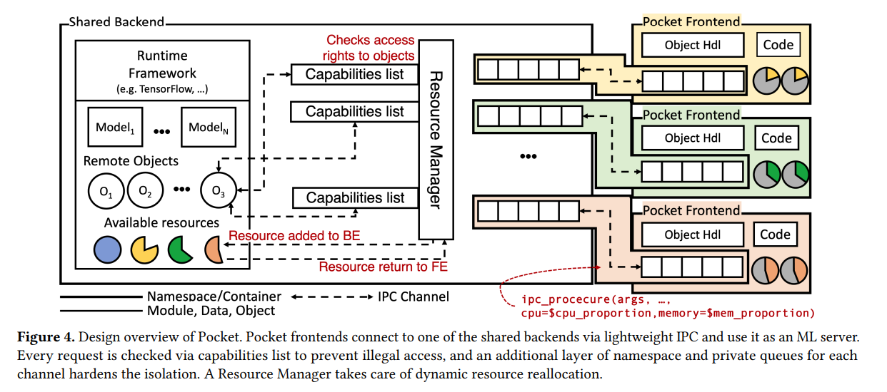

# [Pocket: ML Serving from the Edge](https://dl.acm.org/doi/pdf/10.1145/3552326.3587459)
## Problem
- ML application on the edge has
    - High resource usage by the underlying framework and packages
    - No resource sharing across instances
    - If naively use a shared backend
        - Decreased performance and resource efficiency
        - Breaks isolation among tenants
## Challenges
- Limitations of Existing Cloud-based Solutions, lack of resource sharing, not scalable
- Building a shared backend
    - Overhead of gRPC (latency + memory)
    - Isolation
    - Resource allocation of ML runtime

## Observations

## Ideas
- Build a system with better resource efficiency,
that can scale to a larger number of client instances
## Contribution
- Design and system support for shared heavy-weight runtimes
- Efficient sharing of resources
## Methods
- light weight IPC
    - Avoid data copying
    - Avoid marshaling/unmarshaling
    - Minimize memory footprint
    - Use shared memory
- Nested namespace for isolation, capability lists to prevent unauthorized access
- Inter-client isolation
- Resource amplification
    - Resource reallocation through cgroups manipulation

## Results

## Application

## Limitation

## Questions