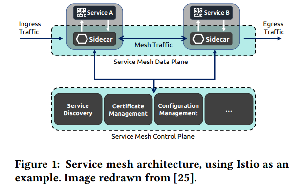

# [Leveraging Service Meshes as a New Network Layer](https://radhikam.web.illinois.edu/ashok21servicemeshes.pdf)
## Problem

## Challenges

## Observations
- Microservice architectures imply that network communication becomes more intrinsic to the application’s internal functioning
## Ideas
- Service meshes lessen the burden on application developers
by factoring out microservice communication functions into
a separate process called a sidecar proxy

- Identify service mesh as a layer in OSI model
    - better visability
    - better knowledge of application needs
    - easier evolvability
    - coordination with lower layers

## Contribution
- Demonstrate how service mesh layer has opportunities and challenges that differ from lower
layers of the stack, but that can be informed by long lines of
networking research. 
    - Service meshes provide more direct visibility, an avenue to
understand applications’ needs
    - a point of coordination with
lower layers
    - easier extensibility
    - They also lead to new
challenges such as performance overhead and cross-stack
coordination of shared resources.

## Methods

## Results

## Application

## Limitation

## Questions