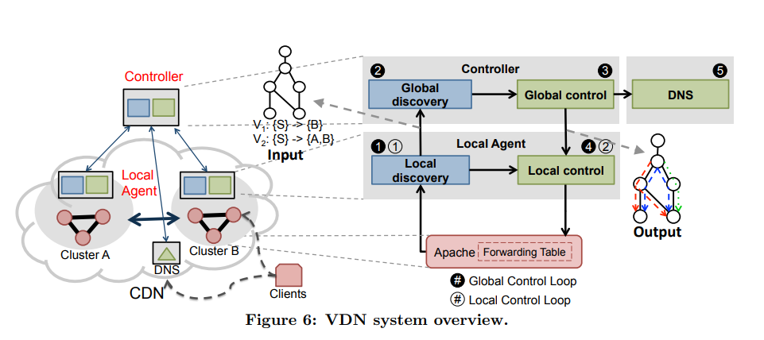

# [Practical, Real-time Centralized Control for CDN-based Live Video Delivery](https://www.cs.cmu.edu/~xia/resources/Documents/Mukerjee_sigcomm15.pdf)
## Problem
- High demand for live video
- Low latency for user, low cost, high volumn, flexibility for CDN, fault tolerance

## Backgrounds
- HTTP-based live streaming
- CDN structure
    - video sources
    - reflectors
    - edge clusters
    - DNS
        - DNS TTL prevents a controller from sending updates
    - Heuristic-based mapping algorithm
        - CDN maps end users to edge clusters based on geography, load, cluster availability, history performance
    
## Challenges
- Require control over individual streams at fine timescales
- Overlay multicast systems, while focusing on individual
stream optimization, overlook issues that arise with the
many concurrent, independent, high-bandwidth streams
in today’s environment.
- Internet-scale, video-specific systems like Conviva’s C3 use client-side analytics to pick the best CDN for a given client at a given time but ignore the actual data delivery
- Traditional CDNs have shied away from centralized designs due to the
difficulty of providing good performance while quickly
handling failures in the wide area 

## Observations
- Requirement
    1. Enables proactive control over cost and quality at fine-grained timescales
    2. Scales to today’s largest CDNs and their workloads
    3. Achieves real-time responsiveness to minimize join time and respond to failures
    4. meets these goals despite wide-area network delays and failures.
## Ideas
- Allow CDN operator to dynamically control both stream placement and restrict bitrates automatically
- Tradeoff between quality and cost
- Scalability
- Fine timescale
- Improve quality with
    - A global view of network resources
    - Coordination across streams
    - Consideration of the streaming bitrates
## Contribution

## Methods
- Hybrid: a centralized controller makes decision slowly and clusters make decisions quickly
- As a control plane, VDN (1) populates application layer forwarding tables at each cluster with centrally
computed entries, (2) creates forwarding table entries
on-the-fly when necessary using distributed control, and
(3) updates the client to edge server mapping accordingly
in the DNS infrastructure.

- Controller uses Paxos for synchronization

1. Initial requests from client to DNS
2. Distribution of state, d(v, b) and c(v, b), like Distance vector protocol. Prioritize global information. If necessary, consult distributed control 

## Results

## Application

## Limitation

## Questions